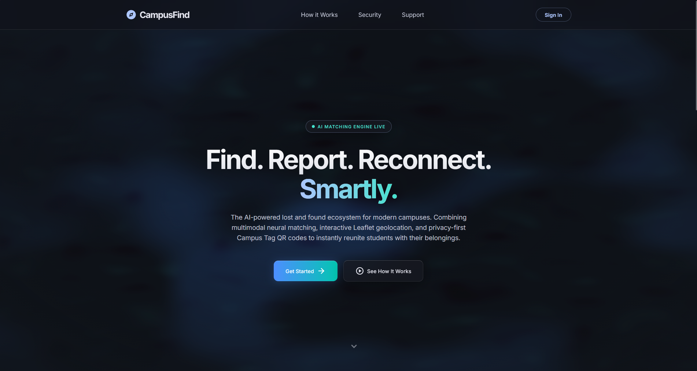
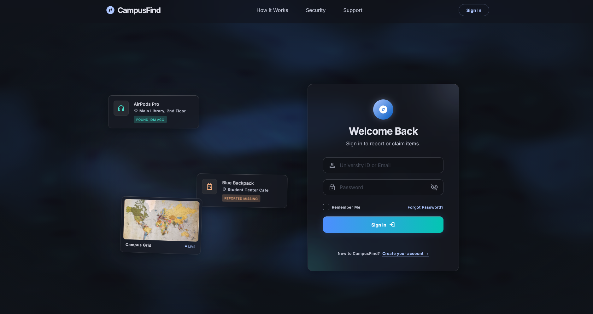
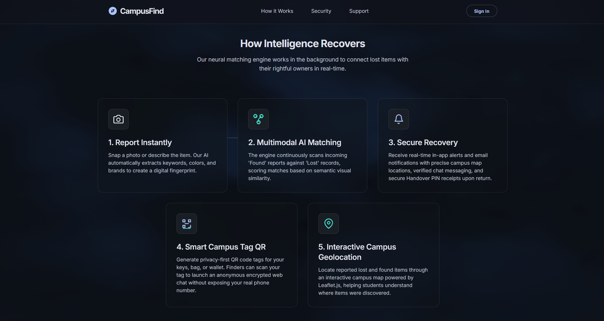

# 🔍 CampusFind

## Smart Lost & Found System for Universiti Pertahanan Nasional Malaysia (UPNM)

**PHP • MySQL • JavaScript • Tailwind CSS • Google Gemini**

CampusFind is an academic web application designed to provide UPNM students with a centralized platform for reporting, discovering, matching, verifying, and recovering lost-and-found items.

The system combines **AI-assisted matching, geospatial functionality, security controls, and Human-Computer Interaction (HCI) principles** to improve the traditional lost-and-found process.

---

## 📖 Project Overview

CampusFind was developed as part of **TSI 3723 — Human Computer Interaction** at **Universiti Pertahanan Nasional Malaysia (UPNM)**.

The system provides a structured alternative to fragmented methods such as WhatsApp groups and physical notice boards by bringing lost-and-found activities into a centralized platform.

The main user journey is:

**Report → Discover → Match → Verify → Communicate → Recover**

CampusFind focuses on helping students identify potential item matches while providing verification and privacy-focused communication features.

---

## 🎯 Project Objectives

The main objectives of CampusFind are to:

* Provide a centralized platform for reporting lost and found items
* Help students discover potentially relevant lost-and-found reports
* Use AI to assist with identifying potential item matches
* Incorporate geographical proximity into the matching process
* Provide verification mechanisms to reduce false claims
* Enable privacy-focused communication between users
* Support a structured item handover process
* Provide administrators with management and analytical tools
* Apply HCI principles to improve usability and user experience

---

## 🔬 HCI Research & User Survey

A survey was conducted among **UPNM students** to understand existing lost-and-found experiences and interest in a dedicated platform.

### Selected Survey Findings

* **91%** supported the CampusFind concept
* **78%** had experienced losing an item
* **95%** indicated that they would use a centralized lost-and-found platform
* **85%** expressed interest in AI-assisted item matching

These findings helped inform the system requirements, feature selection, and interface design.

---

## ✨ Key Features

### 1. Smart Item Reporting & Discovery

Users can report lost or found items with information such as:

* Item name
* Description
* Category
* Location
* Date and time
* Item images

Users can browse and search reports to identify potentially relevant items.

---

### 2. 🤖 AI-Assisted Item Matching

CampusFind uses the **Google Gemini 3.6 Flash API** to assist users in identifying potential relationships between lost and found item reports.

The matching process can consider:

* Item descriptions
* Visual information from uploaded images
* Semantic similarities
* Location proximity

AI-generated matches are presented as **potential matches** to assist users. Human verification remains part of the recovery process.

---

### 3. 🗺️ Geospatial Functionality

CampusFind incorporates location-based functionality to help users discover relevant reports based on geographical proximity.

Technologies and approaches include:

* Leaflet.js
* MapLibre GL JS
* Turf.js
* Haversine distance calculations
* Interactive map-based search

Users can interact with campus locations and explore relevant lost-and-found reports.

---

### 4. 🏷️ Privacy-First Campus Tags

CampusFind includes a **Campus Tag** feature that allows users to generate QR codes associated with personal belongings.

A finder can scan a Campus Tag and access a controlled method of contacting the owner without unnecessarily exposing the owner's personal contact information.

---

### 5. 🔐 Verification Gatekeeper

To help prevent false claims, CampusFind provides an owner-defined verification question.

A claimant must provide the appropriate answer before proceeding with the relevant recovery process.

The system also incorporates additional validation mechanisms to make the verification process more resistant to incorrect or unauthorized claims.

---

### 6. 💬 Anonymous Communication

CampusFind provides a communication system designed to reduce unnecessary exposure of users' personal identities.

Chat participants can communicate using masked identifiers rather than directly exposing personal information.

Messages are encrypted at rest using **AES-256-CBC** within the application.

---

### 7. 🤝 Secure Handover

CampusFind includes a structured handover verification process using a unique PIN.

The PIN provides an additional confirmation mechanism when an item is physically returned.

The system can also generate a **PDF handover receipt** to document the recovery process.

---

### 8. 📊 Administrative Dashboard

Administrators have access to management and analytical functionality, including:

* Lost-and-found report management
* Campus location management
* Spatial analysis
* Matching review
* Notifications
* Security-related analytics
* Weekly reporting

The administrative interface provides tools for monitoring and managing campus lost-and-found activity.

---

## 🧠 AI + Spatial Matching Workflow

CampusFind combines AI-assisted analysis with geographical information.

A simplified workflow is:

```text
User submits report
        ↓
Relevant opposite-type reports identified
        ↓
Gemini 3.6 Flash analyses text/image information
        ↓
Location proximity is considered
        ↓
Potential matches are presented
        ↓
User verification
        ↓
Item recovery
```

This approach combines **semantic/visual information and location context** rather than relying solely on keyword-based searching.

---

## 🛡️ Security Features

Security was considered throughout the application design.

The project incorporates mechanisms including:

* Password hashing
* CSRF token validation
* Session-based authentication
* Prepared SQL statements
* Input validation
* Rate-limiting mechanisms
* AES-256-CBC message encryption
* Controlled claim verification
* Separation of configuration credentials from public source code

---

## 💻 Technology Stack

### Frontend

* HTML5
* CSS3
* JavaScript (Vanilla ES6+)
* Tailwind CSS
* Leaflet.js
* MapLibre GL JS
* Turf.js
* SweetAlert2
* Chart.js
* html2pdf.js
* QRCode.js

### Backend

* PHP
* MySQL / MariaDB

### AI

* Google Gemini 3.6 Flash API

### External Services

* Resend API

### Security

* Password hashing
* CSRF protection
* Prepared statements
* Session authentication
* AES-256-CBC encryption
* Rate-limiting mechanisms

---

## 👤 Project Context & My Role

**Institution:** Universiti Pertahanan Nasional Malaysia (UPNM)

**Course:** TSI 3723 — Human Computer Interaction

**Project:** CampusFind Smart Lost & Found

### My Role

**Jittesh A/L Amaran — Project Manager & Full-Stack Developer**

I independently designed and developed the CampusFind system, including:

* System architecture and overall project design
* Frontend interface and user experience
* PHP backend development
* MySQL database integration
* AI-assisted matching functionality
* Geospatial and map-based functionality
* Authentication and security mechanisms
* Anonymous communication and message encryption
* Campus Tag and QR functionality
* Handover verification and PDF receipt generation
* Administrative dashboard and analytics
* HCI research and user evaluation
* System testing and debugging
* Project documentation and presentation

---

## 🤖 AI-Assisted Development & Design

AI-assisted development tools were used as part of the development workflow.

### Google AI Studio

**Google AI Studio** was used as a development assistance tool for parts of the application, including:

* Coding assistance
* Debugging and troubleshooting
* Code refinement
* Feature implementation guidance
* Development suggestions

The generated suggestions and code were integrated, adapted, reviewed, and tested within the CampusFind project.

### Google Stitch

**Google Stitch** was used during the UI design and prototyping process, particularly for:

* Landing page design
* Login page design
* Interface layout exploration
* Initial visual design concepts

The resulting designs were adapted and integrated into the CampusFind application.

AI-assisted tools formed part of the development workflow, while the overall system design, integration, testing, implementation decisions, and project development were carried out as part of the project.

---

## 🧪 Project Status & Limitations

CampusFind is a **functional academic and portfolio project** developed and tested in a local development environment.

The current version demonstrates the core workflows and features described in this repository. However, as an academic project, it may still have limitations, edge cases, or occasional issues depending on factors such as:

* Local PHP configuration
* MySQL/MariaDB configuration
* Browser environment
* API availability
* External service configuration
* Different deployment environments

The system should therefore be viewed as a **demonstration and learning project rather than a production-ready university-wide deployment**.

### Current Considerations

* AI-assisted features depend on Google Gemini API availability and configuration
* Email functionality depends on external email service configuration
* Map functionality depends on relevant third-party libraries and services
* Some features require appropriate local configuration before use
* The public repository excludes production data and credentials
* Further testing and security hardening would be required for a real university-wide deployment

---

## 🔐 Public Repository Security

This repository contains a **GitHub-safe portfolio version** of CampusFind.

The following are intentionally excluded:

* Production database dumps
* Real student records
* Real names
* Matriculation numbers
* Real phone numbers
* Real email addresses
* Real chat histories
* Production API keys
* Database credentials
* Encryption secrets
* User-uploaded files
* Server logs
* Debug logs

A configuration template is provided:

```text
config.env.example.php
```

For local development, create your own:

```text
config.env.php
```

and enter your own credentials and API keys.

**Do not commit `config.env.php` or other secret files to GitHub.**

---

## 🚀 Local Setup

### 1. Clone the Repository

```bash
git clone https://github.com/Jittesh26/campusfind-upnm.git
cd campusfind-upnm
```

### 2. Set Up a Local PHP Server

CampusFind can be run using a local PHP development environment such as:

* XAMPP
* Laragon
* Other PHP/MySQL development environments

Make sure PHP and MySQL/MariaDB are running.

### 3. Configure the Environment

Copy:

```text
config.env.example.php
```

to:

```text
config.env.php
```

Then configure your own:

* Database host
* Database username
* Database password
* Database name
* Google Gemini API key
* Resend API key
* Encryption key
* Base URL

### 4. Database Setup

Create a local MySQL/MariaDB database and configure the database connection in `config.env.php`.

The production database and real user data are **not included** in this public repository.

### 5. Upload Directory

Create an `uploads/` directory if required by the local installation.

User-uploaded files should not be committed to GitHub.

### 6. Run the Application

For XAMPP, place the project inside:

```text
C:\xampp\htdocs\
```

Then open:

```text
http://localhost/campusfind/
```

---

## 📸 Screenshots & Demo

### Landing Page







---

## 🔮 Future Improvements

Potential future improvements include:

* University Single Sign-On (SSO) integration
* Real-time push notifications
* WebSocket-based communication
* Dedicated mobile application
* Improved AI matching accuracy
* Additional accessibility improvements
* Expanded analytics and reporting
* Integration with additional campus services
* Further security hardening and penetration testing
* Production deployment optimization

---

## 📚 Project Purpose

CampusFind was created as a **university academic project and portfolio project** to explore the practical application of:

* Full-stack web development
* Artificial intelligence
* Geospatial technologies
* Database systems
* Cybersecurity principles
* Human-Computer Interaction
* User-centered system design

The project demonstrates how these technologies can be combined to address a practical campus problem.

---

## 🔗 Repository

**GitHub Repository:**

https://github.com/Jittesh26/campusfind-upnm

---

## 📄 License

This project was developed for academic and portfolio purposes.

Please contact the repository owner before reusing substantial portions of the project or its implementation.

---

© 2026 CampusFind — Smart Lost & Found System for UPNM
